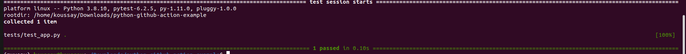
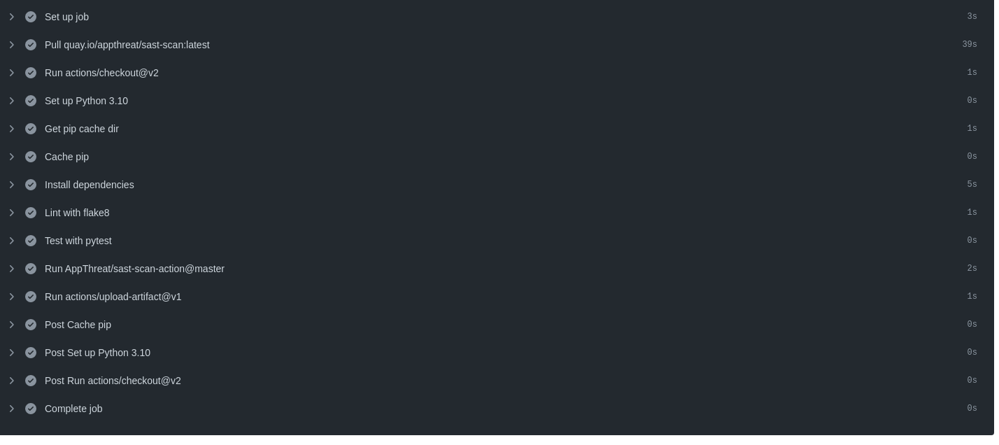
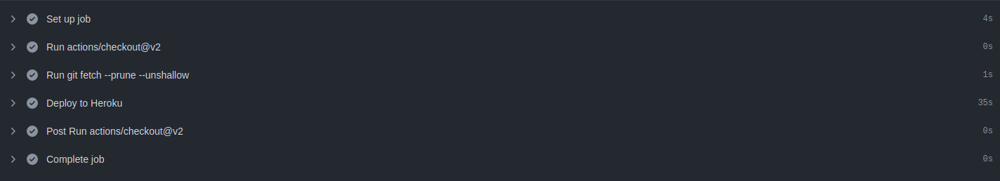
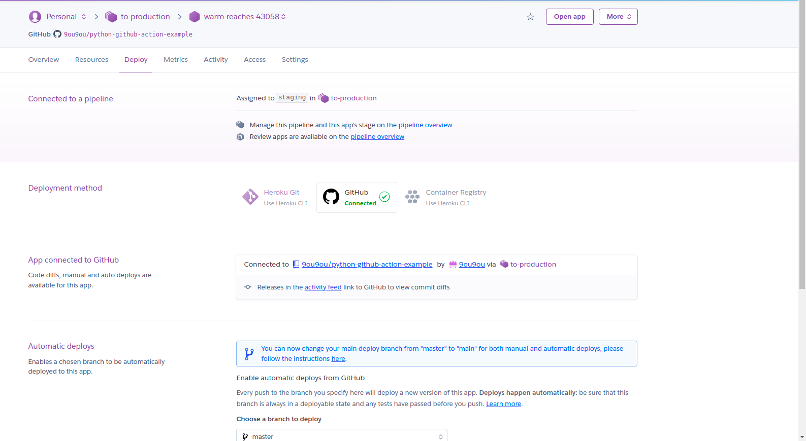
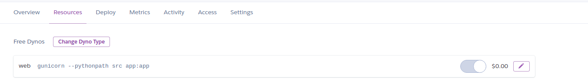
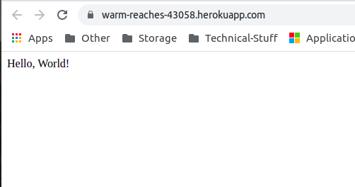
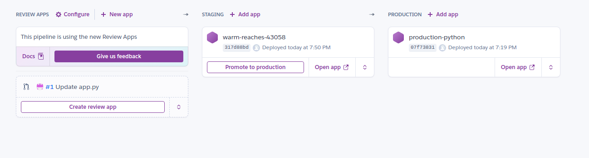
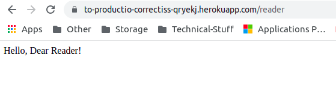
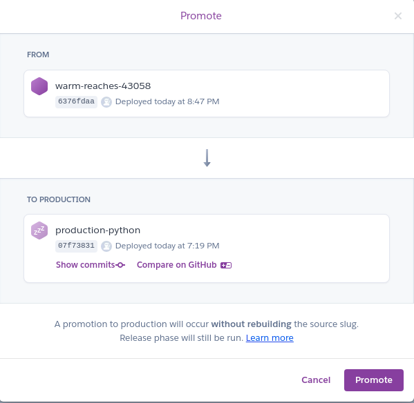

# CICD Tutoriel

Welcome aboard dear reader, in this repository, you will find the differents setups and configurations used to create a **CI/CD** to heroku Service.

## The application 
We will beguin with the application running in the local environment. It is a really simple application that show Hello World message. To run it, you can run the following command

``` bash
git clone https://github.com/9ou9ou/python-github-action-example.git
cd python-github-action-example
python3 src/app.py
```

Also a unit function is implemented to test the returned value of the index function. To run it, you simply specify the python src path and use pytest like the following

```
export PYTHONPATH=src
pytest
```

We obtain this result


## Continous Integration
In this paragraph, we will speak about the process of **CI** using Github action. To this reason, we created a workflow under the **.github/workflows** folder

We have the following feature:

1- Checking out the code

2- Caching the application

3- Installing dependecies

4- Linting with Flake8

5- Test with pytest

6- Doing a Sast Analysis and upload report to the github actions dahsboard.

This is translated by the build job in the python-app.yml. The excution workflow is the following:


## continous delivery

We will promote our staging project to heroku PASS because of his free resources.
So to identify to  our heroku repo after its creation, we need a way to issue a creadentials. Thanks to heroku API, we can use the following command to issue a life long token to authenticate

```
heroku authorazations:create
```

So we add our repository to the git then push the code to heroku upstream.

This workflow is described in the second job in the python-app.yml called deploy. This the result of our running.


To illustrate the environment of python, we added 2 files, Proctfile and runtime.txt. Proctfile will tell heroku to run our code with gunicorn server and runtime.txt will specify the python version.

## Output in the heroku





We obtain the following output at the following URL **https://warm-reaches-43058.herokuapp.com/**



## The Production

We added a new project called to-production and warm-raches-43058 as its staging project, we enabled also the review code option.



Let's try to create a pull request via editing our app.py and change the api to reader! 

We can before merging our request, by enabling the review option, we can oversee the impact of the changed code on the codebase line then decide if the changes are worth or not.
The following screenshot show the pull request execution


After merging the request, the ci/Cd pipeline in the github using actions will do its work.

After that, we can promote the staging code to the production one manually just by a click and a new version will be released


We obtain the production code on the following URL: 
**https://production-python.herokuapp.com/**